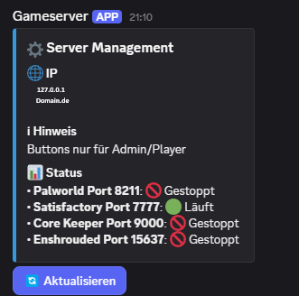
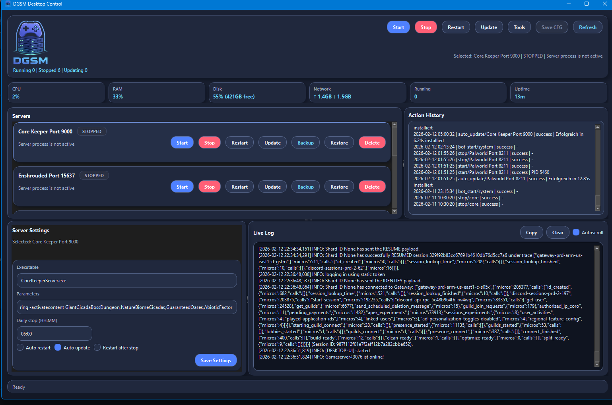
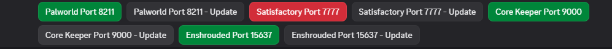
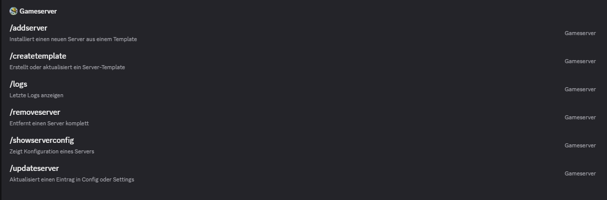
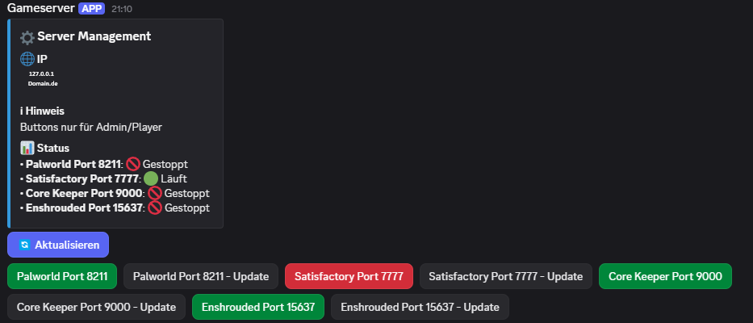

# DGSM – Discord Gameserver Manager


Manage and automate your game servers directly from Discord – no remote desktop required.\
Designed as a lightweight alternative to WindowsGSM, DGSM runs entirely through Discord commands and buttons.





---

## ✨ Features

- Start / Stop / Restart / Status via buttons and slash commands
- Optional local **Windows Desktop UI**
- Create ZIP backups via `/createbackup`
- Restore server data from ZIP backups via `/restorebackup`
- Live operation states in UI (start/stop/update/backup/restore)
- Optional auto-update and scheduled restart
- Manage multiple servers (Palworld, Core Keeper, Satisfactory, Unturned…)
- Role & permission checks for admin actions
- SQLite logging, JSON configuration
- **First run setup**: guided prompt for required `.env` values
- Runs on Windows servers without RDP

---

## 📦 Installation

1. **Install Python 3.12**\
   [https://www.python.org/downloads/](https://www.python.org/downloads/)\
   Make sure to check **"Add Python to PATH"** during installation.

2. **Download DGSM**

   - Click the green **Code** button → **Download ZIP**
   - Or clone:
     ```bash
     git clone https://github.com/meowztho/DGSM-Discord-Gameserver-Manager.git
     cd DGSM-Discord-Gameserver-Manager
     ```

3. **Install dependencies**

   ```bash
   pip install -r requirements.txt
   ```

4. **First run setup**\
   Simply start the bot:

   ```bash
   # from repository root
   python src/Main.py

   # or from inside src/
   python Main.py
   ```

   On first run, DGSM will:

   - Prompt for missing required values (`DISCORD_TOKEN`, channels, domain)
   - Encrypt sensitive values in `src/.env`
   - Load server entries from `src/server_config.json` (if present)

   After setup:

   - Manage templates in `src/plugin_templates/`
   - Add servers via `/addserver` (recommended) or directly in `src/server_config.json`
   - For a second server with the same template/app, set `instance_id` in `/addserver` (optional)
   - Backups are stored in `src/steam/backup`

---

## ⚙️ Discord Bot Setup

Before running DGSM with a real token, you must create a bot account in the Discord Developer Portal.

1. **Go to the Developer Portal**\
   [https://discord.com/developers/applications](https://discord.com/developers/applications)

2. **Create a new application**

   - Click **New Application**
   - Name it (e.g., `DGSM Server Manager`)

3. **Add a Bot User**

   - Go to **Bot** in the left menu
   - Click **Add Bot** → **Yes, do it!**
   - Enable these intents:
     - `PRESENCE INTENT`
     - `SERVER MEMBERS INTENT`
     - `MESSAGE CONTENT INTENT`
   - Reset token and copy it for `.env`

4. **Set Admin Channel ID**

   - In Discord, enable **Developer Mode** (Settings → Advanced)
   - Right-click your admin channel → **Copy Channel ID**
   - Add to `.env`

5. **Invite the bot to your server**

   - Go to **OAuth2 → URL Generator**
   - Under **SCOPES**, check:
     - `bot`
     - `applications.commands`
   - Under **BOT PERMISSIONS**, check:
     - `Send Messages`
     - `Embed Links`
     - `Read Message History`
     - `Use Slash Commands`
   - Copy the generated URL → open in browser → Authorize bot for your server.

6. **Create required roles**

   - In your Discord server settings, go to **Roles** and create:
     - **Admin** – for full bot control and all admin commands
     - **Player** – for basic usage such as viewing status, starting servers (if allowed)
   - Assign these roles to users accordingly. The bot checks these roles to determine command permissions.

---

## 🖥️ Local Windows Desktop UI (Addon)

DGSM now includes a local desktop control window for Windows.

- Starts automatically together with the bot
- Uses **PySide6 (Qt for Python)** with a modern dark Soft-UI style
- Uses the same backend logic as Discord commands
- Discord stays the main control path
- Includes card-based server controls and live console output
- Settings changed in desktop UI are pushed to Discord status panel refresh
- Unsaved setting edits stay in the form until you press `SAVE CFG`

Dependency note:

```bash
pip install -r requirements.txt
```

This installs `PySide6` for the desktop UI.

Environment toggle:

```env
DGSM_DESKTOP_UI_ENABLED=true
```

Set it to `false` to disable the desktop window.

Optional: hide the separate console window while desktop UI is open:

```env
DGSM_HIDE_CONSOLE_WHEN_UI=true
```

---

## 📷 Screenshots

| Main Menu | Server Status |
| --------- | ------------- |
|||
|||
||

---

## 📥 SteamCMD Setup

Some servers require SteamCMD to install or update.

1. Download from Valve:\
   [https://developer.valvesoftware.com/wiki/SteamCMD](https://developer.valvesoftware.com/wiki/SteamCMD)

2. DGSM supports these SteamCMD locations:

   - `steam/steamcmd.exe` relative to `Main.py` directory (this is `src/steam/steamcmd.exe` when started from repo root)
   - Path from env variable `STEAMCMD_PATH`
   - Any SteamCMD available in your system `PATH`

3. Optional: set `STEAMCMD_PATH` in `src/.env`, for example:

   ```env
   STEAMCMD_PATH=C:\\Tools\\SteamCMD\\steamcmd.exe
   ```

---

## 💾 Backup & Restore

DGSM supports Discord-driven backups and restores.

- Default backup folder: `src/steam/backup`
- Create backup: `/createbackup name:<server>`
- Restore backup: `/restorebackup name:<server> backup_file:<file.zip> overwrite:<true|false>`
- Backup selection supports files from `src/steam/backup` (and legacy `src/backups` if present)
- Bot responses show short backup paths like `/steam/backup/<file>.zip` (no full absolute path)
- UI updates automatically after backup/restore and does not stay stuck on "Backup running"

---

## Configuration File Reference

DGSM reads and writes its runtime config in `src/server_config.json`.

### 1. `src/server_config.json`

```json
{
  "log_retention_days": 7,
  "server_paths": {
    "Palworld-main": {
      "app_id": "2394010",
      "executable": "PalServer.exe",
      "instance_id": "Palworld-main",
      "username": "steam_user_optional",
      "password": "gAAAA...encrypted..."
    }
  }
}
```

Fields used by the bot:

- `log_retention_days`: retention for action logs in SQLite.
- `server_paths.<name>.app_id`: required Steam AppID.
- `server_paths.<name>.executable`: optional executable file name.
- `server_paths.<name>.instance_id`: optional instance folder key. `/addserver` can set this explicitly, otherwise it is generated automatically.
- `server_paths.<name>.install_dir`: optional custom serverfiles path (absolute or relative to `src/`).
- `server_paths.<name>.username` / `password`: optional Steam login. Password is encrypted in config.

### 2. `src/plugin_templates/<TemplateName>/`

Each template folder normally contains:

- `config.json`: install/update metadata like `app_id`, `executable`, update flags and optional Steam credentials.
- `server_settings.json`: copied into the server instance and used for runtime options.

### 3. `server_settings.json` per server instance

Typical locations:

- Legacy layout: `src/steam/GSM/servers/<app_id>/serverfiles/server_settings.json`
- Instance layout: `src/steam/GSM/servers/<app_id>/instances/<instance_id>/serverfiles/server_settings.json`

Notes:

- Keep backups before manual edits.
- JSON must be valid.

---

## 💖 Support this project

If DGSM saves you time or helps you run your servers, please consider supporting development:

- [**GitHub Sponsors**](https://github.com/sponsors/meowztho)
- [**Paypal**](paypal.me/farrnbacher)

---

## 📜 License

MIT – see [LICENSE](LICENSE) for details.

