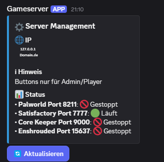
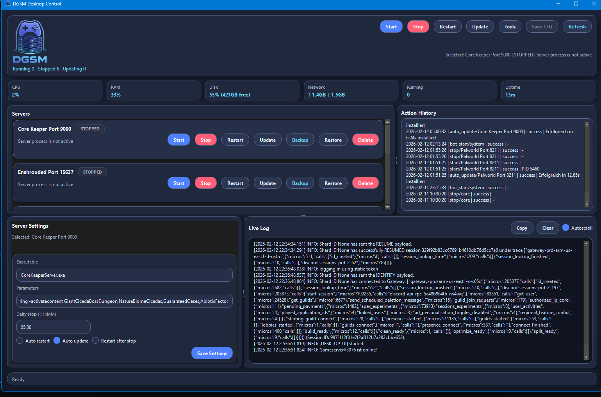
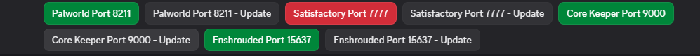
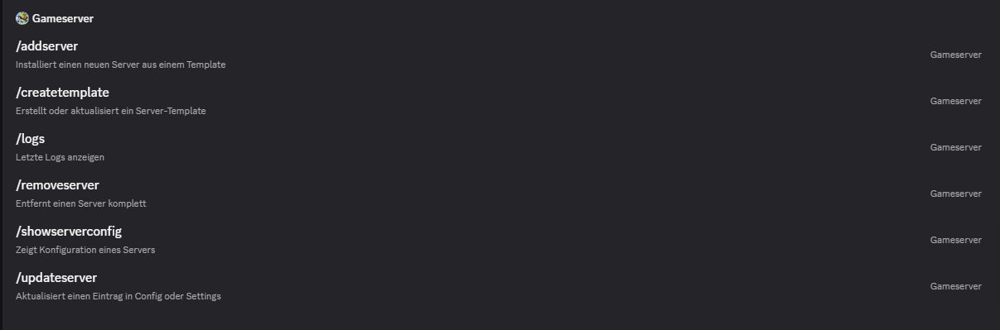
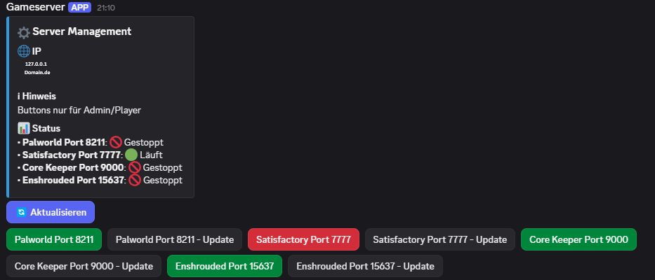

# DGSM – Discord Gameserver Manager
## for Windows and Linux(untested).


Manage and automate your game servers directly from Discord – no remote desktop required.\
Designed as a lightweight alternative to WindowsGSM, DGSM runs entirely through Discord commands and buttons on Windows and new on Linux(untested).




---

## ✨ Features

- Start / Stop / Restart / Status via buttons and slash commands
- Optional local **Desktop UI** (Windows/Linux)
- UI-only startup mode if Discord env values are missing
- Create ZIP backups via `/createbackup`
- Restore server data from ZIP backups via `/restorebackup`
- Live operation states in UI (start/stop/update/backup/restore)
- Optional auto-update and scheduled restart
- Manage multiple servers (Palworld, Core Keeper, Satisfactory, Unturned…)
- Role & permission checks for admin actions
- SQLite logging, JSON configuration
- Automatic SteamCMD download (if missing) into `src/steam/`
- Automatic runtime detection for Windows/Linux behavior
- Runs on Windows and Linux servers
- Keeps existing templates usable with OS-specific executable fallback
- Normalized template JSON schema across all `plugin_templates`

---

## 📦 Installation

1. **Install Python 3.12**\
   [https://www.python.org/downloads/](https://www.python.org/downloads/)\
   On Windows, check **"Add Python to PATH"**. On Linux, install `python3` and `pip` via your distro package manager if needed.

2. **Download DGSM**

   - Click the green **Code** button → **Download ZIP**
   - Or clone:
     ```bash
     git clone https://github.com/meowztho/DGSM-Discord-Gameserver-Manager.git
     cd DGSM-Discord-Gameserver-Manager
     ```

3. **Install dependencies**

   ```bash
   pip install -r requirements.txt
   ```

4. **First run**\
   Simply start the bot:

   ```bash
   # from repository root
   python src/Main.py

   # or from inside src/
   python Main.py
   ```

   On first run, DGSM will:

   - Load values from `src/.env` (if present)
   - Auto-create `ENCRYPTION_KEY` in `src/.env` if missing
   - Start in UI-only mode if Discord env is incomplete
   - Load server entries from `src/server_config.json` (if present)

   After setup:

   - Manage templates in `src/plugin_templates/`
   - Add servers via `/addserver` (recommended) or directly in `src/server_config.json`
   - For a second server with the same template/app, set `instance_id` in `/addserver` (optional)
   - Backups are stored in `src/steam/backup`

---

## 🚀 Release Package (Code + Dist)

From `v2.0.1`, releases can include both:

- full source code (as before)
- prebuilt Windows package in `dist/DGSM/`

Detailed changes for this release: [RELEASE_NOTES_v2.0.1.md](RELEASE_NOTES_v2.0.1.md)

Start prebuilt version with:

```powershell
dist\DGSM\DGSM.exe
```

Important: keep the source tree next to `dist`, because runtime data stays in `src/`.

Runtime paths used by DGSM:

- `src/.env`
- `src/server_config.json`
- `src/server_pids.json`
- `src/plugin_templates/`
- `src/steam/`
- `src/steam/steamcmd.exe` (Windows) or `src/steam/steamcmd.sh` (Linux)
- `src/steam/GSM/servers/`

---

## ⚙️ Discord Bot Setup

Before running DGSM with a real token, you must create a bot account in the Discord Developer Portal.

1. **Go to the Developer Portal**\
   [https://discord.com/developers/applications](https://discord.com/developers/applications)

2. **Create a new application**

   - Click **New Application**
   - Name it (e.g., `DGSM Server Manager`)

3. **Add a Bot User**

   - Go to **Bot** in the left menu
   - Click **Add Bot** → **Yes, do it!**
   - Enable these intents:
     - `PRESENCE INTENT`
     - `SERVER MEMBERS INTENT`
     - `MESSAGE CONTENT INTENT`
   - Reset token and copy it for `.env`

4. **Set Admin Channel ID**

   - In Discord, enable **Developer Mode** (Settings → Advanced)
   - Right-click your admin channel → **Copy Channel ID**
   - Add to `.env`

5. **Invite the bot to your server**

   - Go to **OAuth2 → URL Generator**
   - Under **SCOPES**, check:
     - `bot`
     - `applications.commands`
   - Under **BOT PERMISSIONS**, check:
     - `Send Messages`
     - `Embed Links`
     - `Read Message History`
     - `Use Slash Commands`
   - Copy the generated URL → open in browser → Authorize bot for your server.

6. **Create required roles**

   - In your Discord server settings, go to **Roles** and create:
     - **Admin** – for full bot control and all admin commands
     - **Player** – for basic usage such as viewing status, starting servers (if allowed)
   - Assign these roles to users accordingly. The bot checks these roles to determine command permissions.

---

## 🖥️ Local Desktop UI (Addon)

DGSM includes a local desktop control window for Windows and Linux (PySide6 required).

- Starts automatically together with the bot
- Uses **PySide6 (Qt for Python)** with a modern dark Soft-UI style
- Uses the same backend logic as Discord commands
- Discord stays the main control path
- Includes card-based server controls and live console output
- Reflects Discord-side command state changes in the desktop dashboard
- Settings changed in desktop UI are pushed to Discord status panel refresh
- Unsaved setting edits stay in the form until you press `SAVE CFG`
- Linux note: a graphical display/session is required for the UI window (headless servers can use Discord-only mode).

Dependency note:

```bash
pip install -r requirements.txt
```

This installs `PySide6` for the desktop UI.

Environment toggle:

```env
DGSM_DESKTOP_UI_ENABLED=true
```

Set it to `false` to disable the desktop window.

Optional: hide the separate console window while desktop UI is open:

```env
DGSM_HIDE_CONSOLE_WHEN_UI=true
```

Note: `DGSM_HIDE_CONSOLE_WHEN_UI` applies to Windows console behavior.

---

## 🛠️ Build Windows EXE

Use the included build script:

```powershell
build.bat
```

The script:

- builds `dist/DGSM/DGSM.exe` with PyInstaller
- embeds `src/Logo.ico` as executable icon
- keeps runtime path logic aligned with `src/`
- ensures required runtime folders exist (`src/steam/GSM/servers`, `src/plugin_templates`)

---

## 📷 Screenshots

| Main Menu | Server Status |
| --------- | ------------- |
|||
|||


---

## 📥 SteamCMD Setup

Some servers require SteamCMD to install or update.

1. DGSM supports these SteamCMD locations:

   - `steam/steamcmd.exe` (Windows) or `steam/steamcmd.sh` (Linux) relative to `Main.py`
   - Path from env variable `STEAMCMD_PATH`
   - Any SteamCMD available in your system `PATH`

2. If SteamCMD is not found, DGSM can auto-download it to `src/steam/` using:

   - `STEAMCMD_DOWNLOAD_URL` from `src/.env`
   - default (Windows): `https://steamcdn-a.akamaihd.net/client/installer/steamcmd.zip`
   - default (Linux): `https://steamcdn-a.akamaihd.net/client/installer/steamcmd_linux.tar.gz`

3. Optional: set `STEAMCMD_PATH` in `src/.env`, for example:

   ```env
   STEAMCMD_PATH=C:\\Tools\\SteamCMD\\steamcmd.exe
   ```

   Linux example:

   ```env
   STEAMCMD_PATH=/opt/steamcmd/steamcmd.sh
   ```

4. If `STEAMCMD_DOWNLOAD_URL` is empty, DGSM chooses the correct default automatically based on OS.

---

## 💾 Backup & Restore

DGSM supports Discord-driven backups and restores.

- Default backup folder: `src/steam/backup`
- Create backup: `/createbackup name:<server>`
- Restore backup: `/restorebackup name:<server> backup_file:<file.zip> overwrite:<true|false>`
- Backup selection supports files from `src/steam/backup` (and legacy `src/backups` if present)
- Bot responses show short backup paths like `/steam/backup/<file>.zip` (no full absolute path)
- UI updates automatically after backup/restore and does not stay stuck on "Backup running"

---

## Configuration File Reference

DGSM reads and writes its runtime config in `src/server_config.json`.

### 1. `src/server_config.json`

```json
{
  "log_retention_days": 7,
  "server_paths": {
    "Palworld-main": {
      "app_id": "2394010",
      "executable": "PalServer.exe",
      "instance_id": "Palworld-main",
      "username": "steam_user_optional",
      "password": "gAAAA...encrypted..."
    }
  }
}
```

Fields used by the bot:

- `log_retention_days`: retention for action logs in SQLite.
- `server_paths.<name>.app_id`: required Steam AppID.
- `server_paths.<name>.executable`: optional executable file name.
  DGSM resolves this OS-aware (for example Linux can auto-try alternatives if template still contains `.exe`).
- `server_paths.<name>.instance_id`: optional instance folder key. `/addserver` can set this explicitly, otherwise it is generated automatically.
- `server_paths.<name>.install_dir`: optional custom serverfiles path (absolute or relative to `src/`).
- `server_paths.<name>.username` / `password`: optional Steam login. Password is encrypted in config.

### 2. `src/plugin_templates/<TemplateName>/`

Each template folder normally contains:

- `config.json`: install/update metadata like `app_id`, update flags and optional Steam credentials.
  `executable` is optional.
  Optional OS overrides: `executable_windows` and `executable_linux`.
- `server_settings.json`: copied into the server instance and used for runtime options.
  If no executable is configured, DGSM auto-detects a start file after install/start and writes hints back.

Behavior summary:

- If a template comes without `executable`, it is accepted.
- DGSM automatically detects a suitable start file on Windows/Linux and writes it back as a hint.
- You can still set `executable_windows` / `executable_linux` explicitly for exact control.

Template schema (normalized):

```json
{
  "app_id": "2394010",
  "executable": "PalServer.exe",
  "executable_windows": "",
  "executable_linux": "",
  "auto_update": true,
  "auto_restart": true,
  "stop_time": "05:00",
  "restart_after_stop": false,
  "parameters": []
}
```

### 3. `server_settings.json` per server instance

Typical locations:

- Legacy layout: `src/steam/GSM/servers/<app_id>/serverfiles/server_settings.json`
- Instance layout: `src/steam/GSM/servers/<app_id>/instances/<instance_id>/serverfiles/server_settings.json`

Notes:

- Keep backups before manual edits.
- JSON must be valid.

---

## 💖 Support this project

If DGSM saves you time or helps you run your servers, please consider supporting development:

- [**GitHub Sponsors**](https://github.com/sponsors/meowztho)
- [**Paypal**](paypal.me/farrnbacher)

---

## 📜 License

MIT – see [LICENSE](LICENSE) for details.

